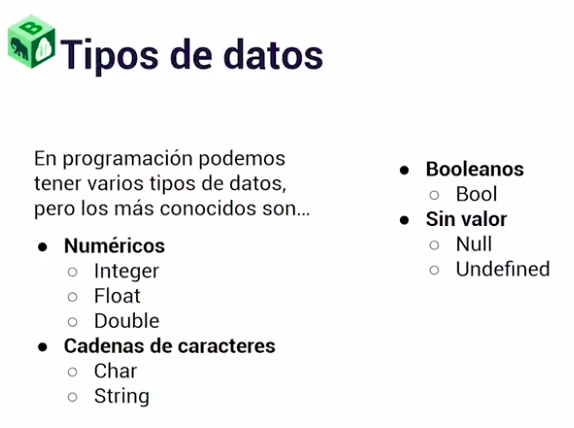

# Tipos de datos




PHP es un lenguaje de programación de tipado débil y dinámico. Esto significa que en PHP:

***Tipado débil***: PHP no requiere que declares el tipo de datos de una variable antes de usarla, y las variables pueden cambiar de tipo durante la ejecución del programa. Por ejemplo, puedes asignar un valor entero a una variable y luego cambiar ese valor por una cadena sin ningún problema.

***Tipado dinámico***: PHP determina el tipo de datos de una variable en tiempo de ejecución según el valor que se le asigna. Esto significa que no es necesario especificar explícitamente el tipo de datos al declarar una variable. PHP asignará automáticamente el tipo de datos adecuado según el valor asignado.

En PHP, como en muchos otros lenguajes de programación, hay varios tipos de datos que puedes utilizar para almacenar diferentes tipos de información. Aquí tienes una descripción de los tipos de datos más comunes en PHP:

- **Enteros (int)**

Representan números enteros sin punto decimal. Pueden ser positivos o negativos.


`$edad = 30;`

- **Flotantes (float)**

Representan números con punto decimal (números de coma flotante). También pueden ser positivos o negativos.

`$precio = 10.50;`

- **Cadenas (string)**

Representan texto. Se pueden definir utilizando comillas simples (') o dobles (").

`$nombre = "Juan";`

- **Booleanos (bool)**
Representan valores de verdadero (true) o falso (false).

`$activo = true;`

- **Arrays**

Son estructuras de datos que pueden contener múltiples valores. Pueden ser indexados numéricamente o asociativos.
 
`$numeros = array(1, 2, 3);`
`$persona = array("nombre" => "Juan", "edad" => 30);`


- **Objetos**

Representan instancias de clases definidas por el usuario. Los objetos tienen propiedades y métodos.

```
class Persona {
    public $nombre;
    public $edad;
}

$juan = new Persona();
$juan->nombre = "Juan";
$juan->edad = 30;
```

- **NULL**

Representa un valor nulo, es decir, una variable sin valor asignado.

`$variable_nula = null;`

- **Recursos (resource)**

Representa una referencia a un recurso externo, como un archivo abierto, una conexión de base de datos, etc.


`$archivo = fopen("archivo.txt", "r");`


Estos son los tipos de datos básicos en PHP. Además de estos, PHP también tiene tipos de datos compuestos y tipos de datos especiales para manejar estructuras más complejas y situaciones específicas.

Es un lenguaje muy permisivo pero a partir de ello puede generar malas practicas, va a ser necesario monitorear siempre los tipos de datos que estamos manipulando en nuestras variables.