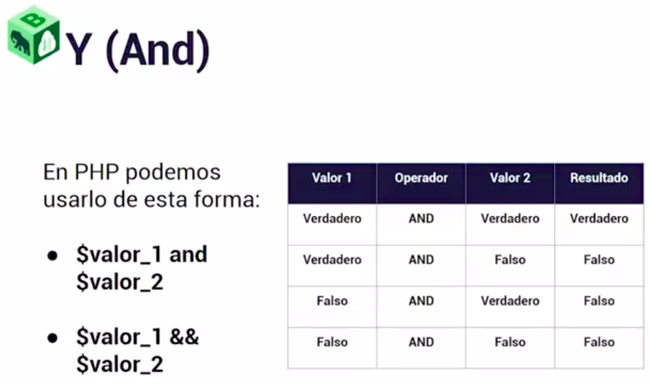
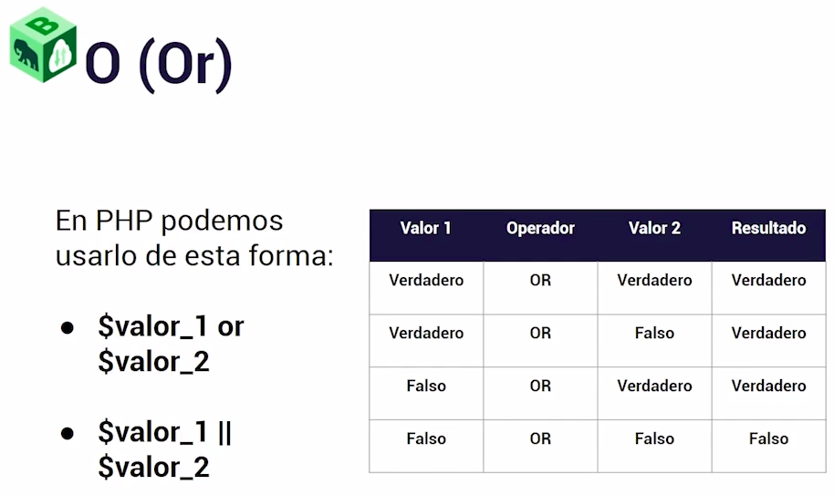
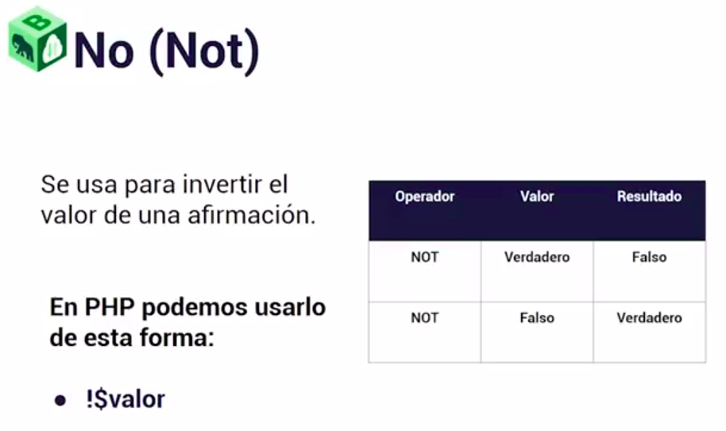

# Operadores logicos

Los operadores lógicos en PHP se utilizan para combinar o comparar expresiones lógicas y producir un resultado booleano (verdadero o falso). Aquí tienes una explicación de los operadores lógicos más comunes en PHP:

- **Operador AND (&& o and)**

El operador AND devuelve verdadero (true) si ambas expresiones que conecta son verdaderas; de lo contrario, devuelve falso (false).


```
$x = 5;
$y = 10;
if ($x > 0 && $y < 20) {
    echo "Ambas condiciones son verdaderas.";
}
```

- **Operador OR ( || o or )**

El operador OR devuelve verdadero (true) si al menos una de las expresiones que conecta es verdadera; devuelve falso (false) solo si ambas expresiones son falsas.



```
$x = 5;
$y = 10;
if ($x > 0 || $y < 0) {
    echo "Al menos una de las condiciones es verdadera.";
}
```

- **Operador NOT (!)**

El operador NOT invierte el valor de la expresión que precede. Si la expresión es verdadera, NOT la vuelve falsa y viceversa.




```
$x = 5;
if (!($x == 10)) {
    echo "La expresión es falsa.";
}
```