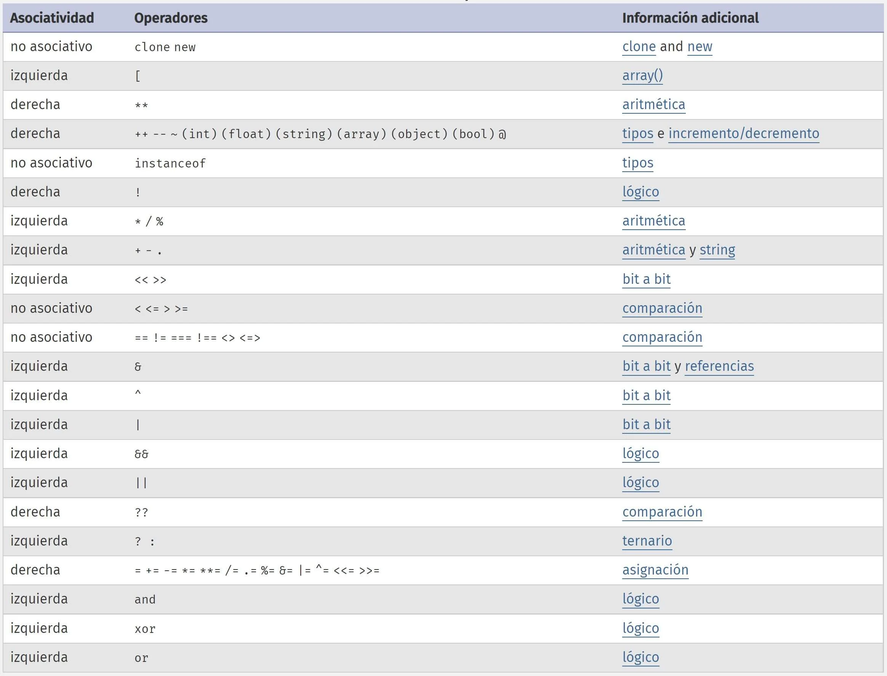

PHP, al igual que otros lenguajes de programación, tiene una serie de reglas de precedencia de operadores predefinidas. Estas reglas determinan el orden en el que se evalúan los diferentes tipos de operadores en una expresión. Algunos operadores tienen una mayor precedencia que otros, lo que significa que se evalúan primero.

Por ejemplo, en PHP, los operadores aritméticos tienen una precedencia más alta que los operadores de comparación. Por lo tanto, en la expresión 10 + 5 > 7, primero se suma 10 + 5, y luego se compara el resultado con 7.


- **Reglas de precedencia php**

En PHP, los operadores tienen diferentes niveles de precedencia, lo que significa que algunos se evalúan antes que otros en una expresión. Aquí tienes una lista de las reglas de precedencia de operadores en PHP, ordenadas de mayor a menor precedencia:

Operadores de agrupación: ( )
Operadores de resolución de ámbito y asociación: ::, ->
Operadores de array: []
Operadores de incremento/decremento: ++, --
Operadores de negación y cast: !, ~, (tipo)
Operadores de multiplicación, división y módulo: *, /, %
Operadores de suma y resta: +, -
Operador de concatenación de cadenas: .
Operadores de comparación: ==, !=, ===, ! ==, <, >, <=, >=
Operador de nave espacial: <=>
Operadores lógicos de cortocircuito: &&, and, ||, or, xor
Operador de fusión de null: ??
Operador ternario: ? :
Operadores de asignación: =, +=, -=, *=, /=, .= entre otros

Estas reglas establecen el orden en el que se evalúan los operadores en una expresión. Si tienes una expresión con varios operadores y no estás seguro de cuál se evaluará primero, puedes utilizar paréntesis para controlar explícitamente el orden de evaluación.


En pocas palabras, la precedencia de operadores es cuando el lenguaje nos dice qué operación pasará primero y qué operación pasará después de acuerdo al operador. Por ejemplo:

```
<?php

$operacion = 1 + 5 * 3;
```

¿Primero suma y luego multiplica? O ¿Primero multiplica y luego suma?

La respuesta es: primero multiplica y luego suma, por lo que nuestra variable $resultado valdrá 16. Esto es debido a que la multiplicación tiene mayor precedencia que la suma.

La asociatividad
Cuando los operadores tienen la misma precedencia, su asociatividad elige si se resuelve la instrucción a partir de la derecha o desde la izquierda.
```
<?php

// Tiene asociatividad de izquierda:
echo 1 - 2 - 3;
```

Observamos que se usa un mismo operador, por tanto, el nivel de precedencia va a ser igual. La asociatividad de “-” es de izquierda, en consecuencia, primero resolverá la resta 1 - 2 y luego restará 3.
```
<?php

echo 1 - 2 - 3;

```
Veamos como serían los estados de la operación ayudándonos del uso de paréntesis:
```
echo 1 - 2 - 3;

echo (1 - 2) - 3;

echo -1 - 3;

echo (-1 - 3);

echo -4
```

Ahora un ejemplo con asociatividad de derecha:
```
<?php

$c = 10;

$a = $b = $c;

echo $a; # 10
echo “\n”; # Salto de línea

```

Primero la variable `$b` se iguala al valor de la variable `$c` y luego resultado se iguala a la variable `$a`:

```
$a = $b = $c

$a = ($b = $c)

$a = (10)

$a = 10
```

Finalmente, se imprime en pantalla el número 10, pues este es el valor de la variable `$a`.

Tabla de precedencia y asociatividad en PHP
Observemos mediante una tabla la precedencia (los de más alta estarán al inicio) y asociatividad de los operadores en PHP:



