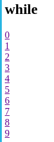

# Ciclos

## for

- Utiliza for con la sintaxis alternativa `:`, `endfor;`.
- La variable `$i` se incrementa en cada iteración y se imprime dentro de una lista `<li>`
```
<ul>
    <?php for ($i = 0; $i <= 10; $i++): ?>
        <li>Bucle <?= $i?> </li>
    <?php endfor; ?>
</ul>
```
{width=100}

## while

- Utiliza while con la sintaxis alternativa `:`, `endwhile;`.
- El contador se incrementa dentro del bucle, y se imprime como un enlace`<a>`.
```
<?php while ($contador < 10): ?>

    <a href=""><?=$contador?></a> <br>

    <?php
        $contador++;
    ?>
        
<?php endwhile; ?>

```

{width=80}


## foreach

- Utiliza foreach con la sintaxis alternativa `:`, `endforeach;`.
- Itera sobre el array $frutas y imprime cada elemento dentro de una lista `<li>`.

```
 <h2>foreach</h2>
<ul>
    <?php
    $frutas = ["Manzana", "Banana", "Cereza"];
    ?>
    <?php foreach ($frutas as $fruta) : ?>
        <li><?= $fruta ?></li>
    <?php endforeach; ?>
</ul>
```
{width=100}
