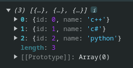

# Enviar variables y/o datos de php a javascript

Generalmente se utiliza la tecnica de imprimir variables de php en codigo html y luego acceder a estas variables desde javascript.

Es muy utilizada para enviar formularios, procesar datos de una base de datos, etc.

En este ejemplo enviaremos un array de php.

```
<?php
$lenguajes = array(
    array(
        "id" => 0,
        "name" => "c++"
    ),
    array(
        "id" => 1,
        "name" => "c#"
    ),
    array(
        "id" => 2,
        "name" => "python"
    )
)
?>

<!DOCTYPE html>
<html lang="en">

<head>
    <meta charset="UTF-8">
    <meta name="viewport" content="width=device-width, initial-scale=1.0">
    <title>Document</title>
</head>

<body>
    <script>
        let lenguajes = JSON.parse('<?= json_encode($lenguajes) ?>')

        console.log(lenguajes)
    </script>
</body>

</html>
```

1. Generación de datos en PHP:

- Se crea un array `$lenguajes` en PHP que contiene información sobre lenguajes de programación (id y nombre).

2. Conversión a JSON:

- La función `json_encode` de PHP convierte el array `$lenguajes` a un string en formato JSON (JavaScript Object Notation).
- El formato JSON es una forma legible por humanos de representar estructuras de datos como objetos y arrays, lo que permite su fácil intercambio entre lenguajes.

3. Inyección de datos en Javascript:

- Se utilizan comillas dobles y la etiqueta de cierre del script `<?php ?>` para insertar el resultado de json_encode dentro del script de Javascript.
- Esto básicamente =="inyecta"== el string JSON con los datos del array en el código Javascript.

4. Lectura de datos en Javascript:

- En el script de Javascript, se utiliza la función `JSON.parse` para convertir el string JSON recibido del código PHP de nuevo a un objeto Javascript.
- La variable lenguajes en Javascript ahora almacena una copia del array original generado en PHP.
- Finalmente, se utiliza` console.log `para imprimir el contenido de la variable lenguajes en la consola del navegador, permitiendo ver la información de los lenguajes de programación.



## Ejecutando las variables desde un archivo index.js

Como tal, si intentamos la conversion de las variables en un archivo externo de javascript, no podremos lograr este resultado, ya que desde el archivo php, solo podemos generar en el mismo archivo codigo html y scripts de javascript que si podra entender.

Lo que si se puede hacer es realizar la conversion y en otro archivo javascript manipular las variables ya convertidas y hacer otras cosas.

Imprimeremos en consola las variables ya convertidas.


```
index.js

```