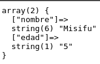

# Manejo de peticiones


Manejo de peticiones GET en PHP
Las peticiones GET son un método HTTP común para recuperar información de un servidor web. En PHP, se manejan utilizando la variable superglobal `$_GET`

Para este ejemplo crearemos un formulario simple en `html` y al ejecutar el boton de submit manejraremos la peticion en un archivo php.

- Codigo html

    - Es importante que los atributos de name y id nunca hagan falta en nuestro formulario.

    - El atributo action indica hacia donde se dirigira la informacion una ves se haga submit

```
<form action="./02_server.php" method="get">

    <label for="nombre">Nombre</label>
    <input type="text" name="nombre" id="nombre">
    <label for="edad">Edad</label>
    <input type="text" name="edad" id="edad">

    <input type="submit" value="Enviar">

</form>

```


- Archivo server.php

Unicamente imprimiremos los valores que se nos mandan.

```
<?php
echo "<pre>";
var_dump($_GET);
echo "</pre>";
?>

```



De esta forma y atraves de la variable global `$_GET` podemos manipular y hacer lo necesario para manejar estas peticiones.


> El Elemento HTML `<pre> `(o Texto HTML Preformateado) representa texto preformateado. El texto en este elemento típicamente se muestra en una fuente fija, no proporcional, exactamente como es mostrado en el archivo. Los espacios dentro de este elemento también 
son mostrados como están escritos.

**`<pre></pre>` nos ayuda a debuguear desde el mismo navegador**
