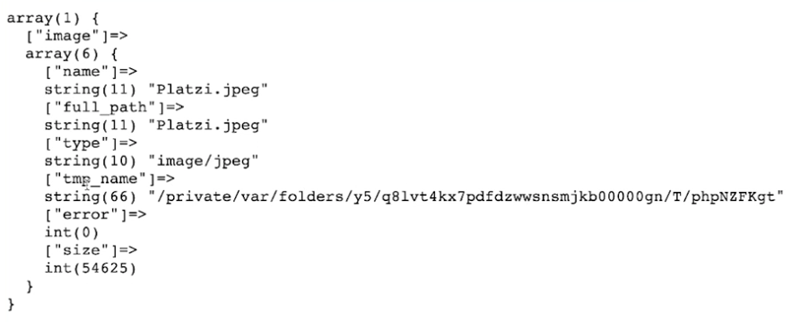

# Envio de archivos 

El envío de archivos desde una petición POST en PHP se realiza utilizando la variable superglobal `$_FILES`. Esta variable contiene un array asociativo con información sobre cada archivo subido, como el nombre, el tamaño, el tipo y la ubicación temporal en el servidor.


- **Pasos para enviar un archivo:**

    - Crear un formulario HTML: El formulario debe incluir un campo de tipo file para que el usuario pueda seleccionar el archivo que desea subir. El atributo name del campo debe coincidir con el nombre que se utilizará para acceder al archivo en el script PHP.

    - Procesar el archivo en el script PHP: En el script PHP, se utiliza la variable global  `$_FILES` para acceder a la información del archivo subido. Luego, se puede mover el archivo a una ubicación permanente en el servidor y realizar otras operaciones con él.

 > Por defecto, al enviar formularios en html tenemos un tipo de encriptacion `application/x-www-form-urlencoded`, sin embargo cuando trabajamos con archivos debempos cambiar este tipo a `multipar/form-data`


- **Formulario html**

    - `enctype="multipart/form-data"` Encriptacion cambiada

```
<form action="./04_server.php" method="post" enctype="multipart/form-data">

    <label for="nombre">Nombre</label>
    <input type="text" name="nombre" id="nombre">

    <label for="image">Imagen</label>
    <input type="file" name="image" id="image">

    <input type="submit" value="Enviar">

</form>
```

- Server.php

```
<?php
echo "<pre>";

var_dump($_FILES);

echo "</pre>";

?>
```

- **Estructura array de `$_FILES`**

Cuando subes una imagen (o cualquier archivo) a través de un formulario HTML en PHP, se genera un array asociativo dentro de $_FILES. Este array contiene varios elementos que proporcionan información sobre el archivo subido.

Supongamos que el campo de entrada del formulario tiene el nombre image. Cuando se sube una imagen, $_FILES['image'] contendrá un array con la siguiente estructura:

```
$_FILES['image'] = array(
    'name' => 'nombre_del_archivo.ext',
    'type' => 'tipo/mime',
    'tmp_name' => 'ruta_al_archivo_temporal',
    'error' => 0,
    'size' => tamaño_del_archivo_en_bytes
);
```
Vamos a desglosar cada uno de estos elementos:

- **`name`**: El nombre original del archivo en el sistema del usuario. Por ejemplo, si el usuario sube un archivo llamado foto.jpg, $_FILES['image']['name'] será 'foto.jpg'.

- **`type`**: El tipo MIME del archivo, que indica el tipo de contenido del archivo. Por ejemplo, para una imagen JPEG, `$_FILES['image']['type']` podría ser 'image/jpeg'.

- **`tmp_name`**: La ==ruta temporal== donde el archivo se guarda en el servidor durante el proceso de carga. Este archivo temporal se mueve o copia a su ubicación definitiva mediante funciones como move_uploaded_file(). Por ejemplo, `$_FILES['image']['tmp_name']` podría ser algo como /tmp/phpYzdqkD.

- **`error`**: Un código de error asociado con la carga del archivo. Un valor de 0 indica que no hubo errores. Algunos otros valores comunes son:

    - `UPLOAD_ERR_OK` (0): No hay error, el archivo se subió correctamente.
    - `UPLOAD_ERR_INI_SIZE` (1): El archivo excede la directiva upload_max_filesize en php.ini.
    - `UPLOAD_ERR_FORM_SIZE` (2): El archivo excede la directiva `MAX_FILE_SIZE` especificada en el formulario HTML.
    - `UPLOAD_ERR_PARTIAL` (3): El archivo fue subido parcialmente.
    - `UPLOAD_ERR_NO_FILE` (4): No se subió ningún archivo.

- **`size`**: El tamaño del archivo en bytes. Por ejemplo, $_FILES['image']['size'] podría ser 204800 (que equivale a 200 KB).



## Guardando archivos/imagenes

Guardar imágenes desde PHP es una tarea común que puede realizarse de varias maneras. A continuación, te daré ejemplos sencillos para guardar imágenes en el sistema de archivos local y también en una base de datos.

- **Guardar imágenes en el sistema de archivos local**

Guardar una imagen subida por un usuario en el sistema de archivos local

- ***Formulario HTML para subir imágenes:***

El formulario HTML debe incluir un campo de tipo `file` para que el usuario pueda seleccionar el archivo que desea subir. El atributo `name` del campo debe coincidir con el nombre que se utilizará para acceder al archivo en el script PHP.
```
<form action="./04_server.php" method="post" enctype="multipart/form-data">

    <label for="nombre">Nombre</label>
    <input type="text" name="nombre" id="nombre">

    <label for="image">Imagen</label>
    <input type="file" name="image" id="image">

    <input type="submit" value="Enviar">

</form>
```

- ***Procesar el archivo en el script PHP:***

En el script PHP, se utiliza la variable superglobal `$_FILES` para acceder a la información del archivo subido. Luego, se puede mover el archivo a una ubicación permanente en el servidor o en local y realizar otras operaciones con él.

```
<?php
echo "<pre>";
print_r($_FILES);
echo "</pre>";

$base_name = $_FILES['image']['name'];
$imagen = $_FILES['image']['tmp_name'];
$ruta_a_subir = "archivos/$base_name";

move_uploaded_file($imagen, $ruta_a_subir);
?>
```

- **`$base_name = $_FILES['image']['name'];`**

Esta línea extrae el nombre de archivo original de la imagen cargada.
`$_FILES['image']` accede a la información relacionada con el archivo cargado con la clave "image" en el formulario HTML.
'name' recupera el nombre de archivo original de la matriz `$_FILES['image']`.

- **`$imagen = $_FILES['image']['tmp_name'];`**

Esta línea almacena la ubicación temporal de la imagen cargada en el servidor.
Similar a la línea anterior, accede al nombre de archivo temporal usando `'tmp_name'`.

- **`$ruta_a_subir = "archivos/$base_name";`**

Esta línea define la ruta de destino final para la imagen cargada.
Crea una variable de cadena `$ruta_a_subir` combinando la cadena `"archivos/"` con el nombre de archivo original almacenado en `$base_name`

- **`move_uploaded_file($imagen, $ruta_a_subir);`**

Esta línea intenta mover la imagen cargada desde su ubicación temporal a la ruta de destino final.

- `move_uploaded_file` es una función incorporada de PHP que realiza la operación de mover el archivo.

- El primer argumento `$imagen` especifica el origen (ubicación temporal) del archivo.

- El segundo argumento `$ruta_a_subir` especifica la ruta de destino final donde se debe guardar la imagen.

>En resumen, este fragmento de código recupera información sobre la imagen cargada, define su ruta de destino final e intenta mover la imagen a su ubicación permanente en el servidor o en local.

> Si hemos subido una imagen y recargamos el navegador, esta imagen se estara resubiendo y sobreescribiendo, lo ideal es manejar el caso y evitar que se sobreescriba o pregguntar al ususario si quiere resubir y/o sobreescribir o subir con otro nombre.