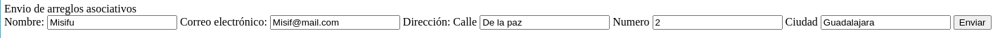

# Enviar arrays por medio de un input en un formulario

Para enviar arreglos en PHP desde un formulario HTML, se deben seguir estos pasos:

1. Crear el formulario HTML:

El formulario HTML debe incluir campos de entrada con nombres que coincidan con los nombres de los índices del arreglo que se desea enviar. Además, se debe establecer el método del formulario como "POST" y el atributo enctype como "multipart/form-data".

```
<form action="05_server.php" method="post" enctype="multipart/form-data">
    <label >Personas</label>
    <input type="text" name="personas[]" >
    <input type="text" name="personas[]">

    <input type="submit" value="Enviar">
</form>
```

2. Procesar los datos en el script PHP:

En el script PHP, se utiliza la variable superglobal `$_POST` para acceder a los datos enviados desde el formulario. Los arreglos enviados se almacenan en arrays asociativos con los mismos nombres que los utilizados en los campos de entrada del formulario.

En este ejemplo unicamente imprimiremos `$_POST` accediendo al nombvre que definimos en el atributo, para ver de que manera nos llega el arreglo.

```
<?php
echo "<pre>";
print_r($_POST['personas']);
echo "</pre>";
?>
```

# Enviar arreglos asociativos

1. **Crear el formulario HTML:**

- El formulario HTML debe incluir campos de entrada con nombres que representen las claves de los pares clave-valor del arreglo asociativo.
- Se puede utilizar un conjunto de campos de entrada con el mismo nombre para un grupo de valores relacionados, diferenciando cada valor con un corchete [].
- El método del formulario debe ser "POST" y el atributo enctype debe ser "multipart/form-data".

En este ejemplo crearemos un formulario en donde todos los inputs conformaran los datos de un usuario, tomando a este como array principal y cada subdato sera rellenado con un input e incluso creando un subarray de direccion

```
<label for="nombre">Nombre:</label>
<input type="text" id="nombre" name="usuario[nombre]">

<label for="email">Correo electrónico:</label>
<input type="email" id="email" name="usuario[email]">

<p>Dirección:</p>
<label for="calle">Calle</label>
<input type="text" id="calle" name="usuario[direccion][calle]">

<label for="numero">Numero</label>
<input type="text" id="numero" name="usuario[direccion][numero]">

<label for="ciudad">Ciudad</label>
<input type="text" id="ciudad" name="usuario[direccion][ciudad]">

```

- **`<input type="text" id="nombre" name="usuario[nombre]">`**

El atributo name se establece en "usuario[nombre]". Esto define el par clave-valor para el nombre del usuario en los datos que se enviarán.
"usuario" representa la clave principal para una estructura de datos de usuario (matriz asociativa).
"[nombre]" especifica "nombre" como la subclave dentro de la estructura "usuario".

Se utiliza la misma logica para el campo de email

- Campos de direccion **`<input type="text" id="calle" name="usuario[direccion][calle]">`**

    - El atributo `name` para los tres se establece en `"usuario[direccion][calle]"`, `"usuario[direccion][numero]"` y` "usuario[direccion][ciudad]"`. Esto crea una estructura anidada dentro de la clave "usuario".

    - `"usuario[direccion]"` actúa como una subclave para la información de la dirección.
    
    - `"[calle]"`, `"[numero]"` y `"[ciudad]"` representan subclaves adicionales dentro de la estructura de la dirección, especificando calle, número y ciudad respectivamente.

> Este fragmento de código HTML crea un formulario que captura información del usuario, incluyendo nombre, correo electrónico y dirección con detalles de calle, número y ciudad. La forma en que se definen los atributos name crea una estructura de matriz asociativa dentro de los datos enviados, lo que facilita el acceso a información específica del usuario en el script PHP que procesa el envío del formulario.



**2. Manejo de la data en server.php**

Unicamente mostraremos los datos que nos son enviados, podemos acceder a cada uno de los datos por notacion de corchetes y haciendo referencia al name con el que se identifico dentro de este atributo

```
echo "<pre>";
print_r($_POST['usuario']);
echo "</pre>";
```


# Checkbox

- En el formulario HTML, cada casilla de verificación debe tener un nombre único o un nombre común con corchetes `[]` para indicar que son parte de un conjunto.
- El valor enviado por una casilla de verificación marcada depende del atributo `value` del elemento. Si no se especifica `value`, el valor enviado será "on". Si se especifica `value`, ese valor será enviado.

```
<input type="checkbox" name="colores[]" value="rojo">Rojo<br>
<input type="checkbox" name="colores[]" value="verde">Verde<br>
<input type="checkbox" name="colores[]" value="azul">Azul<br>
```

2. Procesar datos de casillas de verificación en PHP:

- En el script PHP que procesa el formulario, se accede a los datos enviados por las casillas de verificación utilizando la variable superglobal `$_POST` y el nombre del campo.
- Si el campo tiene un nombre único, el valor de la casilla de verificación marcada se almacenará en la variable correspondiente.
- Si el campo tiene un nombre común con corchetes, los valores de todas las casillas de verificación marcadas se almacenarán en un array asociativo con los valores de value como índices.

```
echo "<pre>";
print_r($_POST);
echo "</pre>";

if (isset($_POST['marcar'])) {
    echo "La casilla de verificación 'Marcar' está marcada";
  } else {
    echo "La casilla de verificación 'Marcar' no está marcada";
  }
  
  // Procesar datos de casillas de verificación con nombre común
  $colores = $_POST['colores'];
  echo "Colores seleccionados: ";
  foreach ($colores as $color) {
    echo $color . ", ";
  }
```
