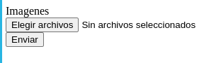
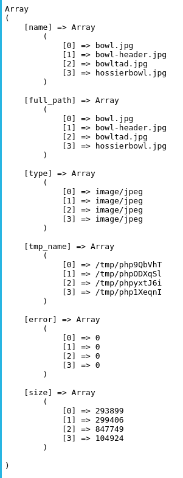

# Subir multiples archivos

Para subir múltiples archivos desde un formulario en PHP, necesitamos ajustar el formulario HTML para aceptar múltiples archivos y luego procesar esos archivos en el script PHP.

```
<form action="06_server.php" method="post" enctype="multipart/form-data">
    <label for="galeria">Imagenes</label><br>
    <input type="file" multiple name="galeria[]" id="galeria"><br>
    <input type="submit" value="Enviar">
</form>
```



En este formulario, el campo de entrada input tiene el atributo multiple, lo que permite la selección de múltiples archivos. Además, el nombre del campo `name="galeria[]"` está en formato de array para manejar múltiples archivos.

En nuestro script unicamente mostraremos como php procesa los archivos.

```
<?php

echo "<pre>";
print_r($_FILES['galeria']);
echo "</pre>";

?>
```

