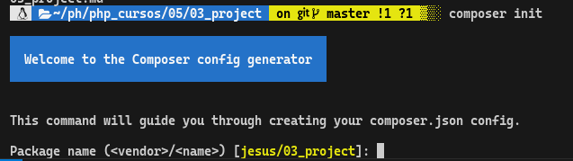
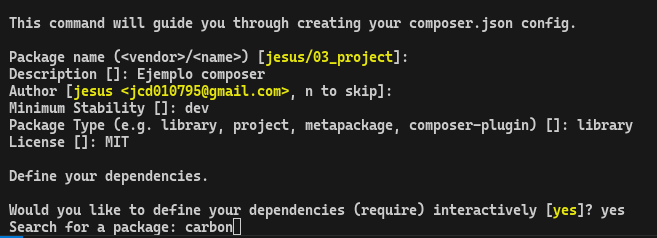

# Composer init

Cuando trabajamos con composer todo gira entorno al archivo principal llamado composer.json y se observa una estructura que puede llegar a intimidar. Existe un comando especifico que nos servira como asistente, en donde responderemos una serie de preguntas y al final se nos generara un archivo bien estructurado dentro de composer.json


>El comando composer init en PHP Composer se utiliza para crear un archivo composer.json en un proyecto. Este archivo es fundamental para la gestión de dependencias y configuraciones de un proyecto PHP. Al ejecutar composer init, Composer te guía a través de una serie de preguntas para generar un archivo composer.json personalizado.

- Comando

`composer init`

Al ejecutar se nos dara la bienvenida al configurador de composer, la primera pregunta siendo ==el nombre del provedor== y ==el nombre del paquete==, automaticamente detecta nuestra configuracion git y nuestra carpeta. Si estamos de acuerdo unicamente apretamos enter.



- La descrpcion debe contener la descripcion exacta de lo que vamos a construir, en este caso unicamenete sera un ejemplo
- Estabilidad minima, corresponde a la diferentes etapas del proyecto ejemplo dev, alpha, fix, etc.
- Posteriormente preguntara que tipo de proyecto estamos desarrollando libreria, framework, plugin, etc. En este ejemplo simularemos la creacion de una libreria.
- La siguiente pregunta corresponde al tipo de licencia, por estandar implementaremos MIT, que es la mas usada en proyectos de software libre.



- En seguida nos hace una pregunta muy interesante, referente a la utilidad de paquetes en produccion, a lo que responderemos que si.
    - Despues nos preguntara que paquetes necesitamos, a continuacion ingresaremos los paquetes que instalamos previamente de forma manual, al teclear carbon nos arroja una lista de los paquetes que contienen esta palabra, y tendremos que escoger por indice.
    - Nos preguntara si requerimos la ultima version, si es asi presionamos enter. si de alguna forma sabemos de anemano que version es laq que necesitamos indicaremos dicha version y se nos instaalara esta.
    - Se conectara a internet, evaluara la ultima version del paquete y se instalara.
    - En seguida nos preguntara si queremos otro paquete y daremos enter para indicar que no

- La siguiente pregunta es acerca de los paquetes que necesitaremos a la hora de desarrollar en donde indicaremos que si necesitaremos estos paquetes.
- Escrbirremos que requerimos phpunit y el ciclo es exactamente el mismo a la adquisicion de paquetes anteriormente realizado.
- Al final de la busqueda de este paquete indicaremos que ya no requerimos mas paquetes

- Finalmente si estamos de acuerdo con esta informacion presionamos enter.
- Antes de terminar nos preguntara si queremos que ya se hagan todas estas instalaciones, a lo que responderemos que no a modo de practica.
- Saldremos del cli y acontinuacion instalaremos las dependencias por medio del comando `composer install`

Antes de ejecutar el comando podemos revisar el archivo composer.json y estara toda la informacion bien estructurada y prolijamente escrita.
- Finalmente si estamos de acuerdo con nuestro archivo de ocnfiguracion instalamos todas las dependencias.

### Archivo composer.json

```
{
    "name": "jesus/03_project",
    "description": "Ejemplo composer",
    "type": "library",
    "require": {
        "nesbot/carbon": "3.x-dev"
    },
    "require-dev": {
        "phpunit/phpunit": "^5.2"
    },
    "license": "MIT",
    "autoload": {
        "psr-4": {
            "Jesus\\03Project\\": "src/"
        }
    },
    "authors": [
        {
            "name": "jesus",
            "email": "jcd010795@gmail.com"
        }
    ],
    "minimum-stability": "dev"
}

```


> El comando composer init es una herramienta poderosa para iniciar la configuración de un proyecto PHP de manera estructurada, asegurando que todas las dependencias y configuraciones se mantengan organizadas y fáciles de manejar.

> Una ventaja de composer es que, si tu necesitas migrar tu proyecto a un servidor o a alguna otra computadora, no es necesario que te copies todas las carpetas, de hecho, la carpeta vendor se suele ignorar, esto es porque, al tener el archivo composer.json, simplemente con correr el comando composer install, composer buscará las dependencias y creará la carpeta vendor automáticamente en cualquier máquina que se ejecute.