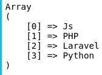
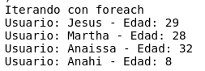
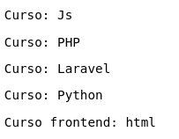

# Arrays

Los arrays en php son estructuras de datos que permiten almacenar multiples valores en una sola variable. Los arrays pueden contenes cualquier tipo de valor incluyendo otros arrays, lo que permite crear estructuras de datos compejas.

- Arrays basicos

1. Arrays indexado: Este tipo de array utiliza numeros enteros como claves. Por defecto, PHP asigna claves numericas que comienzan desde cero.

```
<?php
// Crear un array indexado
$frutas = array("Manzana", "Banana", "Naranja");

// Acceder a un valor en el array
echo $frutas[0]; // Imprime "Manzana"
?>

$courses = ["Js", 'PHP', 'Laravel', 'Python'];

echo "<pre>";
print_r($courses);
echo "</pre>";
```



2. Array asociativo: Utiliza claves personalizadas para cada valor, lo que permite una relacion clave-valor.

```
<?php
// Crear un array asociativo
$edades = array("Juan" => 25, "Ana" => 30, "Pedro" => 35);

// Acceder a un valor en el array
echo $edades["Ana"]; // Imprime 30
?>
```

- Iteracion de arrays

En PHP, iterar arrays es una tarea común y se puede hacer de diversas maneras. Dos de los métodos más comunes son usando foreach y array_walk. 

1. Iterar con `foreach`

El bucle for each es una forma sencilla y eficiente de iterar sobre arrays en PHP. Se utiliza principalmente para recorrer todos los elementos de un array.

ejemplo con array simple
```
$courses = ["Js", 'PHP', 'Laravel', 'Python'];

foreach ($courses as $course) {
    echo "<br>";
    print_r($course);
}
```

Ejemplo con array asociativo
```
$users_age = [
    "Jesus" => 29,
    "Martha" => 28,
    "Anaissa" => 32,
    "Anahi" => 8
];

echo "Iterando con foreach <br>";
foreach ($users_age as $user => $age) {
    echo "Usuario: $user - Edad: $age <br>";
}

```



2. Iterar con array_walk

`array_walk` es una funcion de php que aplica una funcion de ususario acada elemento de un array. Es mas flexible que `foreach` por que permite ejecutar una funcion personalizada con cada elemento del array.

```
courses = ["Js", 'PHP', 'Laravel', 'Python', 'html'];

echo "<pre>";

array_walk($courses, function ($course){
    if ($course == "html"){
        echo "<pre>";
        echo "Curso frontend: $course";
        echo "</pre>";
    } else {
        echo "<pre>";
        echo "Curso: $course";
        echo "</pre>";
    }
});

echo "</pre>";

```



### Diferencias y Ventajas

- `foreach`: Es más simple y directo para la mayoría de los casos de iteración. Es la opción preferida cuando solo necesitas iterar y posiblemente modificar los elementos de un array.

- `array_walk`: Es útil cuando necesitas aplicar una función más compleja a cada elemento del array o cuando necesitas mantener el array intacto pero realizar acciones basadas en sus elementos. También permite pasar un tercer parámetro adicional a la función de usuario.