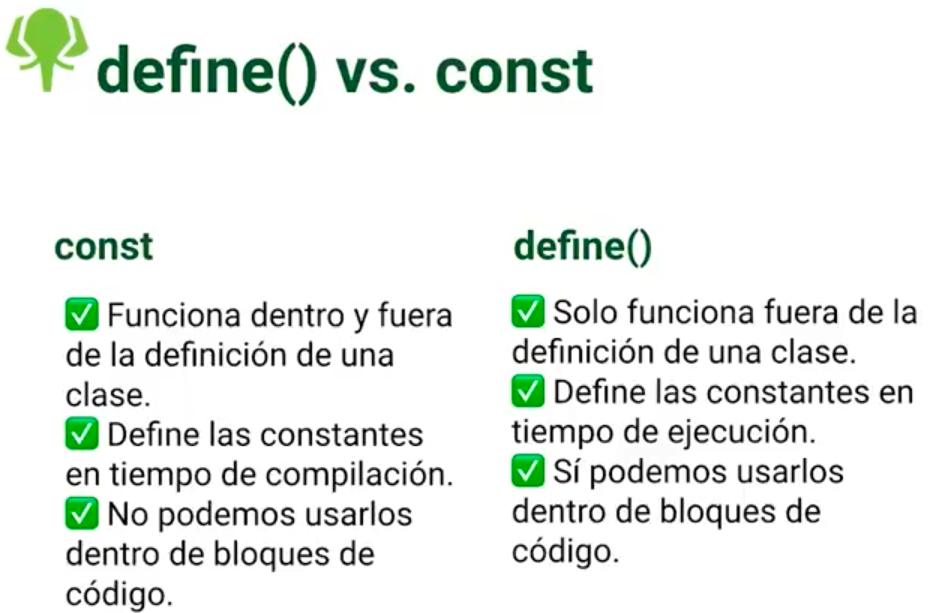
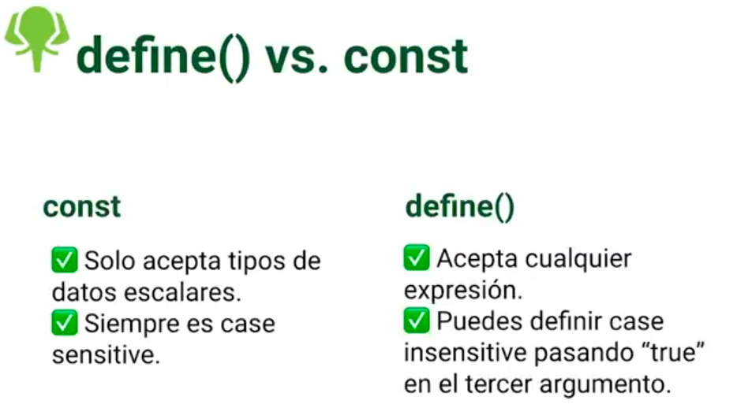

# Define vs const

Por convencion todas las constantes se deben declarar en mayusculas.

{width="500px"}
{width="500px"}

- Ejemplo

```
$decision = true;

if ($decision) {
    define("BLOCK_CONST", "Constante creada dentro de bloque");

    echo (BLOCK_CONST);
}

// Este if nos arrojara un error de sontaxis por que const no se puede declarar dentro de un bloque.
//Incluso el editor de cosgio nos arroja un error.

if ($decision) {
    const BLOCK_CONST = "Constante creada dentro de bloque";

    echo (BLOCK_CONST);
}
```