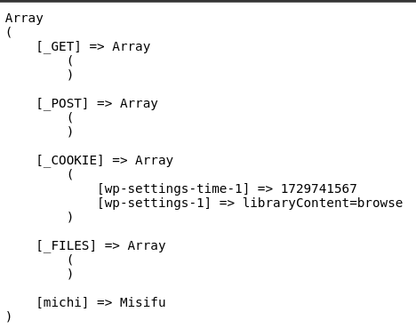

# Que son las variables superglobales?

Estas son variables predefinidas por PHP que estan disponibles en cualquier parte del codigo, incluso sin necesidad de usar la palabra reservada `global`.

- Algunos ejemplos son:

    - `$GLOBALS`
    - `$_SERVER`
    - `$_GET`
    - `$_POST`
    - `$_FILES`
    - `$_COOKIE`
    - `$_SESSION`
    - `$_REQUEST`
    - `$_ENV`

```
<?php

$michi = "Misifu";

echo "<pre>";
print_r($GLOBALS);
echo "</pre>";

?>
```
{width=400px}

