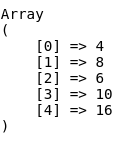

Ene php las funciones anonimas y arrow functions son formas de definir funciones sin nombre. Ambas permiten crear funciones de manera mas concisa y son utiles para peraciones que requieren funciones de corta duracion como callbacks o funciones pasadas como argumentos.

# Funciones anonimas

Tambien son conocidas comom *Closures*, son fucniones sin nombre que pueden ser asignadas a una variable o pasada directamnte como argumento. Son muy utiles en programacion funcional y cuando necesitamos definir funciones rapidamente dentro de otras funciones.

- **Sintaxis**

```
$greeting = function($name)
{
    return "Hola $name";
}

echo greeting("Jesus"); // Output: Hola Jesus
```

- **Funcion anonima como parametro de otra funcion**

```
$numbers = [2,4,3,5,8];

$numbers_by_2 = array_map(function($current){
    return $current *2;
}, $numbers);

echo "<pre>";
print_r($numbers_by_2);
echo "</pre>";
```

- Definimos un array de numeros leatorios
- Creamos un array nuevo por medio del metodo map, en donde utilizaremos una funcion anonima para poder indicar la logica que necesitamos durante el recorrido de la funcion map.
- En este caso unicamente retornaremos todos los numeros multiplicados por dos.
- Finalmente como segundo argumento del metodo map, pasamos el array sobre el cual se trabajra el map.

{with: 300px }

- Sintaxis alternativa

Podemos crear la funcion anonima asignada a una variable para despues pasarala como un parametro masa nuestra funcion map.

```
$numbers = [2,4,3,5,8];

$function_by_3 = function($current){
    return $current * 3;
};

$numbers_by_3 = array_map($function_by_3, $numbers);

echo "<pre>";
print_r($numbers_by_3);
echo "</pre>";
```

>Al ejecuatr esta sintaxis, no se invoca la funcion dentro de la funcion map, simplemente se pasa como parametro el nombre de la variable que almacena a la funcion anonima.


## Closures

Los closures pueden captturar variables del entorno en el que fueron definidas mediante la palabra clave `use`.

```
$message = "Hola";
$greeting = function($name) use ($message)
{
    return "$message $name";
}

echo greeting("Jesus"); // output: Hola Jesus
```

>Cuando queremos que una variable externa exista dentro de un Closure sin necesidad de pasarla como parametro, podemos usar la palabra reservada `use`
> Esta palabra reservada unicamente nos permite leerla mas no permite sobreescribirla, no se podran asignar nuevos valores a estas variables.

# Arrow functions

Son una forma mas concisa de definir funciones anonimas. Utilizan la sintaxis fn y tienen una notacion ms compacta. ==Las arrow function heredan automaticamene las variables del ambito padre, por lo que no necesitas usar `use`==.

- **Sintaxis**

```
$greeting = fn($name) => "Hola $name";

echo $greeting("Jesus"); // Hola Jesus


```

- Ejemplo con funcion map

```
$numbers_by_5 = array_map(fn($current)=> $current *5, $numbers);

echo "<pre>";
print_r($numbers_by_5);
echo "</pre>";
```

- Ejemplo con funcion filter

```
$edades = [12,17,18,29,28,33];

$mayores_de_edad = array_filter($edades, fn($current) => $current >= 18);

echo "<pre>";
print_r($mayores_de_edad);
echo "</pre>";
```